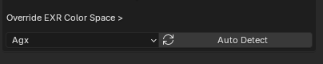
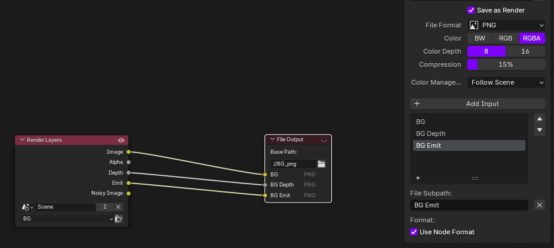
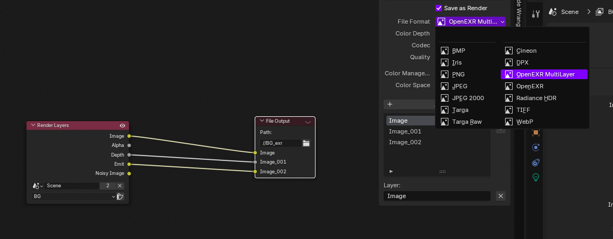

# WE3DOOH RENDERER

## Internal User Manual

---

## Overview

WE3DOOH RENDERER is an in-house Blender addon designed to standardize Cycles render settings, view layer output management, and basic compositor setup for the WE3DOOH pipeline.

The addon focuses on:

- Fast Cycles render setup
- Per-view-layer PNG / EXR output control
- Automatic compositor node generation
- Consistent output structure for studio work

> This addon is not intended to replace manual compositing workflows.  
> It provides a starting point, not a complete compositing system.

---

## Important Notes

- This addon is for WE3DOOH internal use only
- Distribution or sharing outside the company is strictly prohibited
- The upper render settings section works only with Cycles
- Eevee is not supported for render settings
- Additional render passes and multilayer EXRs are not handled automatically

---

## Installation

1. Download the addon as a ZIP file
2. Open Blender
3. Go to `Edit → Preferences → Add-ons`
4. Click **Install**
5. Select the ZIP file
6. Enable **WE3DOOH RENDERER**
7. The addon will appear in the 3D Viewport → Sidebar → **W3DH Renderer**

---

## Interface Overview

The addon panel is divided into three main sections:

1. **Cycles Render Settings** (Top section)
2. **Layer Manager**
3. **Compositor**

---

## Cycles Render Settings

⚠️ This section works only for the Cycles render engine

This section controls the most commonly used Cycles render options used in the WE3DOOH pipeline.

### Adaptive Sampling

- Enables or disables adaptive sampling
- When enabled, the **Noise Threshold** becomes active

### Noise Threshold

- Controls how aggressively Cycles stops sampling
- Lower values = cleaner image, longer render time

### Max Samples

- Maximum number of samples per pixel

### Min Samples

- Minimum samples used by adaptive sampling

### Denoise

- Toggles Cycles denoising

### Motion Blur

- Toggles render motion blur

> These controls are directly linked to Blender’s Cycles settings and update in real time.

---

## Layer Manager

The Layer Manager controls output generation per View Layer.

Each View Layer has:

- **PNG toggle**
- **EXR toggle**
- **Render enable toggle**

### PNG / EXR Toggles

- PNG enabled → PNG output will be generated for this layer
- EXR enabled → EXR output will be generated for this layer
- You can enable both if needed
- If both PNG and EXR are disabled, that layer will be ignored during compositor setup

### Enable in Render

- Toggles whether the View Layer is enabled for rendering
- Disabled layers will not render or generate outputs

### Reset to Default

- Enables all View Layers
- Resets output to:
  - PNG: ON
  - EXR: OFF

![Layer Manager]

---

## Compositor Section

This section controls automatic compositor node generation.

### Enable Compositor

- This toggle is directly linked to Blender’s **Compositor → Use Nodes** option
- Turning this ON enables compositing
- Turning this OFF disables compositing
- Updates in real time

### EXR Color Space

- Controls the color space used for EXR outputs
- If you want the EXR output to match the current scene color space:
  - Click **Auto Detect**
    
  

  - The addon will automatically detect the active scene color settings and apply the correct EXR color space
- You can also manually select:
  - Standard
  - Agx
  - Filmic
  - ACEScg
- If the scene color space cannot be detected, a warning will appear

### Compositor Limitations (Important)

⚠️ This addon does **NOT** support:

- Additional render passes
- Multilayer EXR outputs

> The compositor setup created by this addon includes only the **Image** pass.  
> If you need **Cryptomatte**, **Depth**, **Normal**, **Custom AOVs**, or **Multilayer EXRs**, you must manually add and connect those passes in the compositor after the initial node generation.

### Setup Compositor

- Click **Setup Compositor** to automatically generate compositor nodes
- What this does:
  - Enables compositing
  - Clears existing compositor nodes
  - Creates Render Layer nodes per View Layer
  - Creates PNG and/or EXR File Output nodes
  - Connects Image output automatically
  - Creates output folders per View Layer

#### Warning

- Before execution, a confirmation dialog appears:
  - Your current compositor setup will be lost
  - This action cannot be undone
- Only proceed if you are sure

## Recommended Workflow

1. Switch render engine to **Cycles**
2. Set render quality using the top section
3. Configure outputs per View Layer in **Layer Manager**
4. Enable **Compositor**
5. Set EXR color space (or use **Auto Detect**)
6. Click **Setup Compositor**
7. Add any extra passes manually if required
8. Render

---

## Final Notes

- This addon is designed for speed and consistency
- It does not replace manual compositing knowledge
- Treat the generated compositor as a base setup
- Always review the node tree before final renders

Do **not distribute or share** outside the company.

### License & Distribution

© CHaRLiE @WE3DOOH

